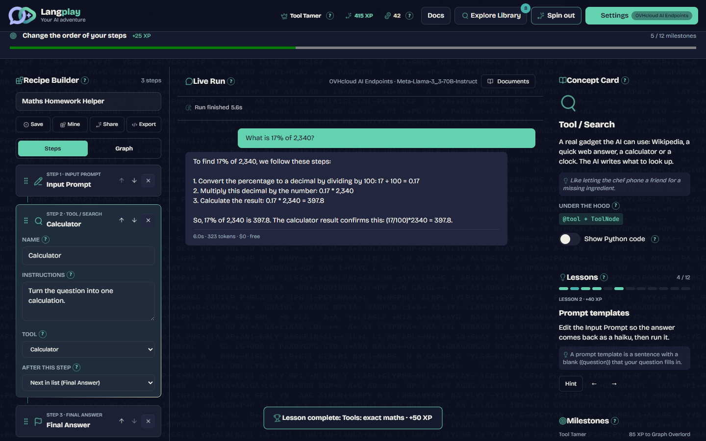
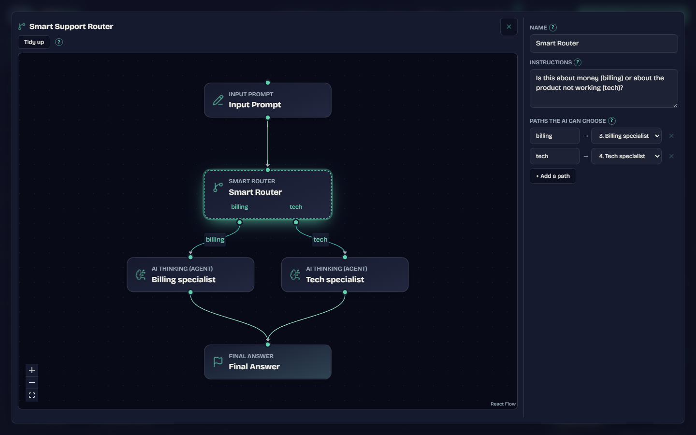
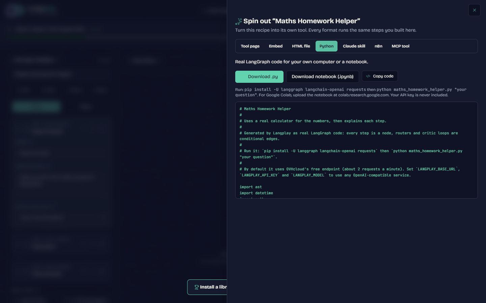
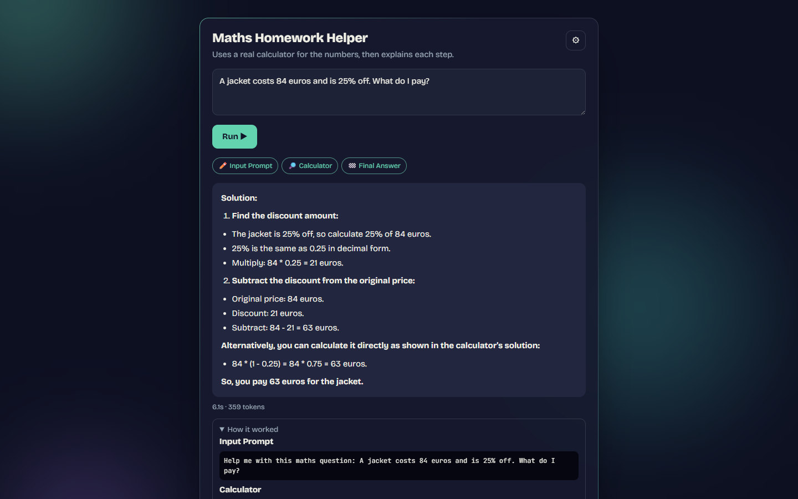
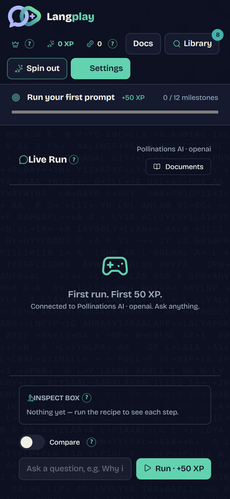

# Langplay

[](https://github.com/DnD-World/langplay/actions/workflows/ci.yml)
[](LICENSE)

**Learn LangChain and LangGraph without writing code: build an AI workflow from blocks, run it on a free AI, see every step, then ship it as your own tool.**



## The problem

LangChain and LangGraph tutorials start with Python, API keys and a notebook. Beginners never get to _see_ what a chain, a tool call, a router or a loop actually does — and when they finally build something, it stays stuck in a notebook.

## What it does

- **Build visually.** Stack steps (prompt, AI, tool, documents, router, critic, final answer) as a list or draw them as a graph with branches and loops.
- **Run on real AI for free.** Free services by default, a 2-minute guide to free keys (Gemini, Groq, OpenRouter), or any OpenAI-compatible service. An offline practice mode if nothing answers.
- **See everything.** Click any step to read the exact prompt sent, the answer, the router's choice, the critic's verdict, sources, time, tokens and cost.
- **Real tools, no keys.** Wikipedia, web answers, an exact calculator, the clock — and search your own PDFs, read inside your browser.
- **Learn by doing.** 12 auto-checked lessons, from your first chain to a critic loop, with XP and ranks.
- **Compare.** Same question through two models or two recipes, side by side.
- **Spin it out.** Turn a recipe into a tool page, a website widget, one HTML file, LangGraph Python, a Claude skill, an n8n workflow, or an MCP tool Claude can call.

## Quick start

```bash
bun install
bun run dev:local      # http://localhost:20136
```

Live: https://langplay.stravelakis.com · In-app docs: `/docs` · Full setup: [INSTALL.md](INSTALL.md) · Full manual: [GUIDE.md](GUIDE.md)

## Screenshots

|                                                                                          |                                                                      |
| ---------------------------------------------------------------------------------------- | -------------------------------------------------------------------- |
|                       |  |
|  |           |

## Status

- **Works:** everything above; 58 automated tests; spin-outs verified end to end (LangGraph 1.2, n8n, MCP over stdio, Cloudflare Worker locally).
- **Limits:** free keyless AI services allow only a few requests (Pollinations asks for payment after a few; OVHcloud ~2 a minute) — a free key is the reliable path. Progress, recipes and documents live in the browser only; no accounts.
- **Next:** see [HANDOFF.md](HANDOFF.md).

## Contributing

Issues and PRs welcome. Please read the [Code of Conduct](CODE_OF_CONDUCT.md). Security problems: see [SECURITY.md](SECURITY.md).

## License

[MIT](LICENSE). Third-party credits in [NOTICE](NOTICE).
